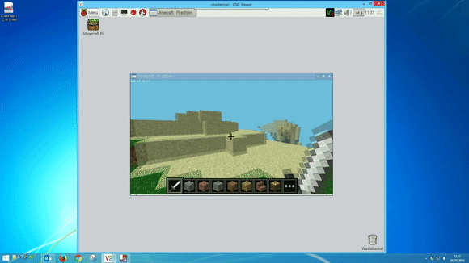
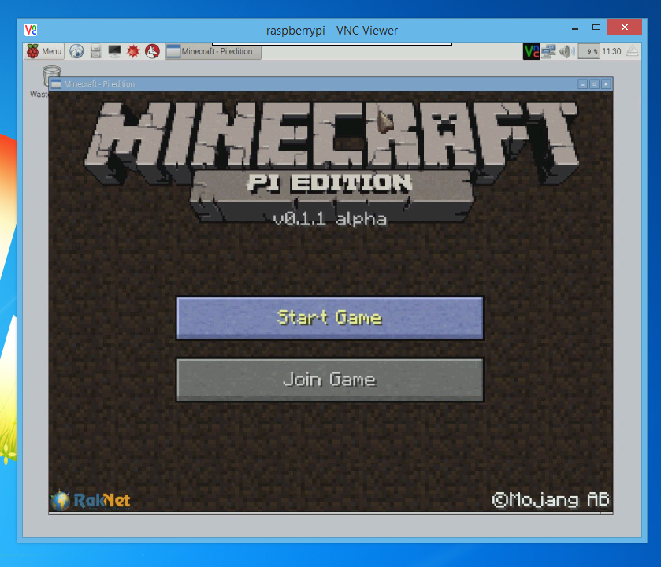
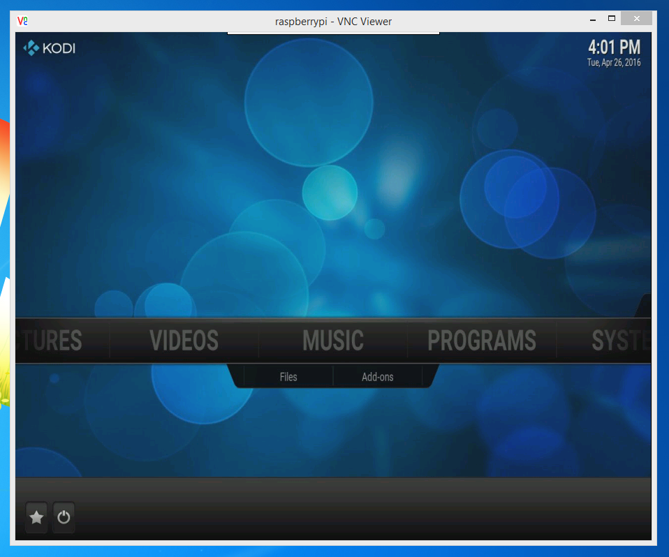

Stable version now available
============================

Thank you to everyone who tried the VNC for Raspberry Pi alpha version!

There is now a [stable version](https://www.realvnc.com/download/vnc/raspberrypi/) of RealVNC Server for Raspberry Pi available on our Website, which incoroprates the improvements that were made in this alpha version, so we highly recommend that you upgrade to this.

The RealVNC Server and Viewer are now also included by default in the **Raspbian Jessie with PIXEL** distribution (2016-09-23 onwards), availble from the [Raspberry Pi Foundation's download page](https://www.raspberrypi.org/downloads/raspbian/).

---

VNC for Raspberry Pi alpha
==========================

[](http://www.youtube.com/watch?v=nMhjg7GdRWY "Pi Video")

*Click the above image for more video of Minecraft over VNC.*

Thanks for your help testing the VNC for Raspberry Pi alpha! This build contains a whole host of improvements over our 5.2 release, including Minecraft support, the ability to render the Pi's text console, and improved performance on all Pi models. 

**Download alpha 1 now from [GitHub Releases](https://github.com/RealVNC/raspi-preview/releases/download/5.3.1.18206/VNC-Server-5.3.1-raspi-alpha1.deb)**

The alpha is automatically licensed with a [Personal license](https://www.realvnc.com/products/vnc/#versions) when you install it on your Raspberry Pi (but feel free to apply an Enterprise license key of your own for additional features). The alpha license will expire at the end of Jan 2017.

As this is an alpha test, you may notice some bugs. A list of [known issues](#knownIssues) and instructions for [leaving feedback](#leavingFeedback) are included at the end of this Readme.

Don't forget you'll need [VNC Viewer](https://www.realvnc.com/download/viewer/) on the device you want to control your Pi from. 

**Note:** You will need to [optimize VNC Viewer](#optimizingVncViewer) to get the best performance from this alpha.

<a name="releaseNotes"></a>

Release notes
=============

- **NEW:** Minecraft can now be played on the Raspberry Pi over VNC ([Service Mode](#startVnc) only).
- **NEW:** The Raspberry Pi's text console can now be accessed over VNC (Service Mode only). 
- **NEW:** Any program which uses a directly rendered overlay (e.g. Kodi, the Pi camera's preview window, omxplayer etc.) can now be used on the Pi over VNC (Service Mode only).  
- **NEW:** VNC Server now uses hardware acceleration on all Pi models, ensuring a faster, smoother experience.  


Prerequisites
=============

- Ensure your Pi is running Raspbian. 
- Ensure you are using your Pi's [recommended power supply](https://www.raspberrypi.org/help/faqs/#powerReqs). 
- For optimal performance, increase your Pi's GPU allocation to at least 128mb (this is 64mb by default). You can do this by running ``sudo raspi-config`` in Terminal and selecting **Advanced options > Memory Split**. 


Installation
============

[Download the VNC Server package from GitHub Releases](https://github.com/RealVNC/raspi-preview/releases/download/5.3.1.18206/VNC-Server-5.3.1-raspi-alpha1.deb), and install using `dpkg` or your favourite package manager. 

e.g. from the command line:
```
curl -OL https://github.com/RealVNC/raspi-preview/releases/download/5.3.1.18206/VNC-Server-5.3.1-raspi-alpha1.deb
sudo dpkg -i VNC-Server-5.3.1-raspi-alpha1.deb
```

You can then [start VNC Server](#startVnc) at the command line. 

You can use the [latest VNC Viewer for your platform](http://www.realvnc.com/download/viewer/), although you may need to [optimize the configuration](#optimizingVncViewer).

<a name="startVnc"></a>

Starting VNC Server
===================

You can run VNC Server in two modes: Service Mode and Virtual Mode. You can even run both at the same time. For more information, see [here](https://www.realvnc.com/products/vnc/raspberrypi/). 

**Note:** Only Service Mode will be able to capture Minecraft and similar applications.

Raspbian "Jessie"
-----------------
To run VNC Server in Service Mode:
```
sudo systemctl start vncserver-x11-serviced.service
```
To have VNC Server start automatically when you power the Pi on:
```
sudo systemctl enable vncserver-x11-serviced.service
```

Raspbian "Wheezy"
-----------------
To run VNC Server in Service Mode:
```
sudo /etc/init.d/vncserver-x11-serviced start
```
To have VNC Server start automatically when you power the Pi on:
```
sudo update-rc.d vncserver-x11-serviced defaults
```

Additional instructions, including how to connect a VNC Viewer device and how to stop VNC Server, are available [here](https://www.realvnc.com/products/vnc/raspberrypi/). 

<a name="optimizingVncViewer"></a>

Optimizing VNC Viewer for the Raspberry Pi
==========================================

To make the most of VNC Server's hardware acceleration, configure VNC Viewer in the following way: 

1. Run VNC Viewer and connect to the Raspberry Pi. 
2. On the VNC Viewer toolbar, click the **Options** button. 
3. Click **Advanced...**, then the **Expert** tab. 
4. Set ``PreferredEncoding`` to ``JPEG``, ``AutoSelect`` to ``False``, and ``ColorLevel`` to ``Full``. 

Playing Minecraft
=================

To play Minecraft over VNC: 

1. Run VNC Server in Service Mode on your Pi and connect to it with VNC Viewer. 
2. On your VNC Viewer device, press the F8 key and ensure **Relative Pointer Motion** is checked. 
3. Start and play Minecraft, as if you were sitting in front of the Pi. 
5. When you finish playing, press F8 and uncheck **Relative Pointer Motion**. 



Running Kodi
============

To use Kodi over VNC: 

1. Run VNC Server in Service mode on the Pi and connect to it with VNC Viewer. 
2. On your VNC Viewer device, press the F8 key and ensure **Relative Pointer Motion** is checked. 
2. Press Ctrl Alt F2 to access the Pi's console. 
3. Run ``kodi``. 
4. Use Kodi, as if you were sitting in front of the Pi. 
5. When you finish using Kodi, exit in the usual way. Then press F8 and uncheck **Relative Pointer Motion**. 



<a name="knownIssues"></a>

Known issues
============

- Kodi only accepts keyboard input over VNC when it is started by running ``kodi`` at the Raspberry Pi's console. 
- Connecting to a headless Pi may result in VNC Viewer's **Options** dialog being cut off. [Increase the Pi's default resolution](https://support.realvnc.com/knowledgebase/article/View/523) to fix. 

For an up-to-date list of known issues, please click [here](https://github.com/RealVNC/raspi-preview/issues). 

<a name="leavingFeedback"></a>

Leaving feedback
================

We'd love to hear your thoughts! If you have any feedback, or if you've spotted a bug, please let us know through GitHub's [issue reports](https://github.com/RealVNC/raspi-preview/issues) page. You can also tweet us [@RealVNC](https://twitter.com/RealVNC) or email us at [raspi@realvnc.com](mailto:raspi@realvnc.com).

Thanks for your help. 
